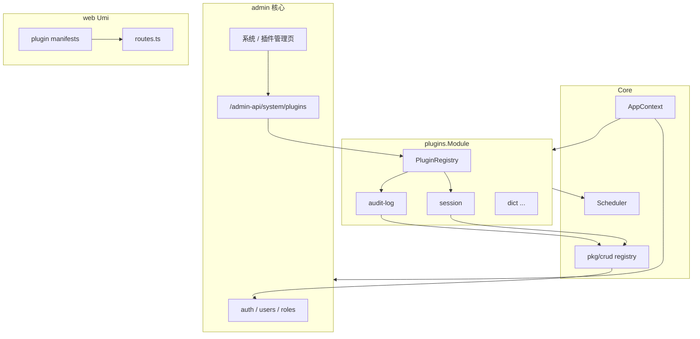
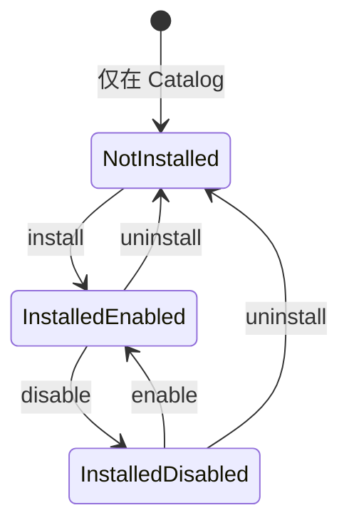

# Bico Admin 插件系统设计

> **状态**：设计稿（待评审）  
> **版本**：v0.3  
> **关联文档**：[项目结构](./structure.md) · [CRUD 包](./crud-pkg.md) · [AI Agent 说明](./AGENTS.md)

本文描述 Bico Admin 的**可选能力插件化**方案：审计日志、登录会话、系统配置 UI、任务管理 UI、CRUD 代码生成、数据字典等以插件交付，核心仓库保持精简。第一期采用**编译期内置插件**（Go module 同仓或子目录），不实现 `.so` 动态加载。

---

## 1. 目标与非目标

### 1.1 目标

| 目标 | 说明 |
|------|------|
| **可选功能解耦** | 非所有部署都需要的能力（如审计日志）不挤在 `internal/admin/handler` 根目录 |
| **统一契约** | 后端：路由、权限、迁移、定时任务、菜单元数据；前端：路由、菜单、`access` 与后端 permission key 对齐 |
| **复用现有栈** | 继续用 `crud.Module`、`AppContext` DI、`/admin-api` 分组与 JWT/权限中间件链 |
| **可安装 / 可卸载** | 插件以「安装」进入环境（建表、登记、权限入树）；「卸载」从环境移除（停任务、清权限绑定、可选删表） |
| **可软禁用** | 已安装但 **禁用** 时无路由/任务，**保留数据与安装记录** |
| **Admin UI 一等公民** | 系统管理内 **插件管理页**：在后台完成 list / install / uninstall / enable / disable（CLI 为补充，非主路径） |
| **可演进** | 契约预留扩展点；第三期再接远程包 / 动态 `.so`，不推翻安装模型 |

### 1.2 非目标（第一期）

- Go `plugin` 包或任意 **运行时加载 `.so`**
- **远程插件市场**（浏览/下载第三方制品）；本地 Catalog 管理 UI 属于 Phase 1
- 跨主版本 ABI 兼容、插件独立发版流水线（仅记录 `Meta().Version`）
- 插件沙箱（进程隔离）；第一期与主程序**同进程、同 DB**
- 替换核心：`admin` 用户/角色/认证、Dashboard、`api` 模块**不**改为插件
- 前端微前端（qiankun 等）；第一期仍为 Umi 单仓构建，仅路由/菜单聚合

---

## 2. 为何需要插件，而不是继续扩展 `crud.Module`

当前扩展路径（见 [crud-pkg.md](./crud-pkg.md)）已很高效：在 `internal/admin/module.go` 的 `NewCRUDModules` 增加一个实现 `crud.Module` 的 Handler 即可。该方式适合**核心、人人需要**的功能。

插件化解决的是另一类问题：

| 维度 | 仅扩展 `crud.Module` | 插件 |
|------|----------------------|------|
| **归属** | 代码落在 `internal/admin`，与核心混排 | `internal/plugins/<id>/` 边界清晰 |
| **交付** | 改主仓、全量发版 | 可独立目录/未来独立仓库，主仓只保留 registry |
| **生命周期** | 编译即存在 | **未安装** 无表无路由；**安装** 建表；**禁用** 软关；**卸载** 硬移除 |
| **横切能力** | 审计、会话等多处 hook，难用单 Handler 表达 | 插件可暴露 `Hooks` + 独立 CRUD UI |
| **前端** | 手改 `web/config/routes.ts` | 插件自带 `manifest` 与页面 chunk |
| **权限树** | 仍走 `crud.AddPermissions` | 相同机制，由插件注册器统一收集 |

**结论**：`crud.Module` 仍是插件内实现 Admin API 的**首选方式**；插件是在其之上的**打包、发现、迁移、任务、前端聚合**层，而不是替代 CRUD 框架。

---

## 3. 架构总览

### 3.1 与现有启动链的关系

今日启动顺序（见 [structure.md](./structure.md) 与 `cmd/main.go`）：

```
BuildContext → (可选) AutoMigrate → RegisterCoreRoutes → RegisterModules(admin, api, job) → Run
```

引入插件后：

```
BuildContext
  → 构建 Catalog（编译期 registry.All()：本二进制「可安装」列表）
  → 从 DB 读取 plugin_installations（已安装 + enabled 状态）
  → Migrate（serve 启动 / migrate 命令）：
        core 模型 + 已安装插件 Models（禁用插件仍迁移/保留表，见 §9）
  → RegisterCoreRoutes
  → RegisterModules(
        admin,
        api,
        plugins.NewModule(catalog, store),  // 仅 enabled ∧ installed 插件注册路由/任务
        job,
    )
  → Run（OnStart） / 关闭（OnStop）
```

**安装 / 卸载 / 启停** 由 core `PluginManager` 写 **`plugin_installations`（唯一真相源）**，主要由 **Admin UI + `/admin-api/system/plugins`** 触发；CLI 与之共用同一服务层。**不要求改 config.yaml**（yaml 仅默认配置模板，见 §9）。

`app.Module` 接口不变（`Name()` + `Register(*AppContext)`），见 `internal/core/app/context.go`。

### 3.2 逻辑分层



### 3.3 API 与前端边界

- 所有后台插件 HTTP 能力默认挂在 **`/admin-api`** 下，与 `internal/admin/router.go` 一致。
- 插件复用 admin 已创建的 **JWT → 用户状态 → RequirePermission** 中间件（通过 `PluginAdminDeps` 注入，避免重复装配）。
- 前端路由 `access` 字段必须与后端 permission key **字符串完全一致**（见 [AGENTS.md](./AGENTS.md) 权限一节）。

---

## 4. 插件生命周期与状态机

### 4.1 四个概念：Catalog / Install / Enable / Uninstall

| 概念 | 含义 | 持久化 |
|------|------|--------|
| **Catalog（目录）** | 当前二进制**能提供**的插件，来自编译期 `registry.All()` | 无（随版本发布变化） |
| **Install（安装）** | 某 Catalog 插件**加入本环境**：建表、写安装记录、默认配置 | `plugin_installations` 行 |
| **Enable（启用）** | 已安装插件**参与运行时**：路由、任务、权限树节点 | 同表 `enabled = true` |
| **Disable（禁用）** | 已安装但**不注册**路由/任务；数据与安装记录保留 | 同表 `enabled = false` |
| **Uninstall（卸载）** | 从环境**移除**安装记录；停任务；清理角色权限；可选删表 | 删除行或 `status=uninstalled`（见 §9） |



- **未安装（Not installed）**：DB 无记录 → 无插件表（除非曾卸载且保留数据，见 §9.4）、无路由、权限树无该插件节点。
- **已安装 + 启用**：完整能力。
- **已安装 + 禁用**：软关闭；表与业务数据保留；下次 `enable` 无需再 migrate（表已存在）。

### 4.2 运行时阶段（每次 `serve`）

| 阶段 | 时机 | 行为 |
|------|------|------|
| **Discover** | 编译期 | `registry.All()` 注册构造器；不做目录扫描 |
| **LoadState** | `BuildContext` 之后 | 读 `plugin_installations`；与 Catalog 求交，丢弃「DB 有但二进制无」的脏数据并打 warn |
| **Migrate** | `migrate` / `auto_migrate` | core + **所有已安装**（含 disabled）插件的 `Models()`，保证禁用仍保留表结构 |
| **Register** | `plugins.Module.Register` | 仅 **installed ∧ enabled**：权限入树、路由、任务 |
| **Start / Stop** | `Run` / 优雅关闭 | 仅 enabled 插件 `OnStart` / `OnStop` |

### 4.3 运维动作：UI 操作、DB 状态与进程内路由

所有 install / uninstall / enable / disable **先写 DB**（`plugin_installations`），Admin UI **立即刷新列表/开关**（以 API 返回为准）。与 **当前 `serve` 进程内已注册路由/任务** 是否一致，见 §9.8。

| 动作 | DB（立即） | UI（Phase 1） | 进程内路由/任务（Phase 1 默认） |
|------|------------|---------------|----------------------------------|
| **install** | 插入记录 + migrate 表 | 状态变「已安装」；可显示 **需重启** 提示 | **下次 `serve` 启动** 后注册 |
| **enable** | `enabled=true` | 开关打开；插件菜单按 `installed` 接口**立即显示/隐藏** | 路由/任务：**重启后**生效；*Stretch*：热摘挂 |
| **disable** | `enabled=false` | 开关关闭；菜单立即隐藏 | 路由/任务：重启前**可能仍可访问**（见 §9.8 风险） |
| **uninstall** | 删记录、清权限、可选 purge | 回到「未安装」；purge 二次确认 Modal | **下次重启** 后确保无路由/任务 |

禁用插件时：**不** `Register` / **不** `OnStart`（针对**新启动**的进程）；权限树 API 仅包含 **installed ∧ enabled** 的插件节点（角色分配 UI 与菜单过滤一致，见 §9.3）。

---

## 5. 后端插件契约（Plugin Interface）

建议新建包：`internal/pkg/plugin`（契约）+ `internal/plugins/*`（实现）。

### 5.1 元数据 `Meta`

```go
type Meta struct {
    ID          string // 稳定标识，如 "audit-log"，用于配置与前端 manifest
    Name        string // 展示名
    Version     string // 语义化版本，第一期仅文档用途
    Description string
    Order       int    // 迁移与权限树相对顺序
    Dependencies []string // 其他插件 ID，第一期可只校验存在性
}
```

### 5.2 核心接口 `Plugin`

```go
type Plugin interface {
    Meta() Meta

    // 返回 GORM 模型指针切片，供 migrate 使用
    Models() []interface{}

    // 声明式 Admin API（推荐）
    AdminCRUDModules(deps *AdminDeps) []crud.Module

    // 非 CRUD 路由：在 /admin-api 下、已带认证中间件的分组内注册
    RegisterAdminRoutes(deps *AdminDeps, rg *gin.RouterGroup) error

    // 定时任务
    RegisterJobs(deps *Deps, s *scheduler.Scheduler) error

    // 菜单元数据（供角色权限 UI / 未来动态菜单；第一期可与前端 manifest 重复一份）
    MenuPermissions() []crud.Permission

    // 配置片段：映射到 config 中 plugins.<id> 或独立 yaml key
    BindConfig(cfg *config.Config) error

    // 安装/卸载钩子（写 DB 种子、清理插件私有缓存等；删表由框架按 PurgeData 调用）
    OnInstall(deps *Deps) error
    OnUninstall(deps *Deps, opts UninstallOptions) error

    // 供卸载时从 admin_role_permissions 批量删除，避免残留死权限
    PermissionKeys() []string

    OnStart(deps *Deps) error
    OnStop(deps *Deps) error
}
```

```go
type UninstallOptions struct {
    PurgeData bool // true：DROP 插件表；false：保留表与数据，仅移除安装记录与运行时
}
```

`AdminDeps` / `Deps` 建议字段（对齐 `AppContext`）：

| 字段 | 来源 | 用途 |
|------|------|------|
| `DB` | `ctx.DB` | 持久化 |
| `Cache` | `ctx.Cache` | 会话、限流、插件缓存 |
| `Logger` | `ctx.Logger` | 结构化日志 |
| `JWT` | `ctx.JWT` | 少见；多数用中间件 |
| `Cfg` / `ConfigManager` | 配置与热更新 |
| `JWTAuth`, `PermMiddleware`, `UserStatus` | 与 `admin.Module` 同源实例 |
| `Uploader` | 上传类插件 |

**原则**：插件**不得**自行 `New` 一套 JWT/权限中间件，必须使用注入的 `AdminDeps`，保证与 [AGENTS.md](./AGENTS.md) 中间件链一致。

### 5.3 与 `crud.Module` 的衔接

- 插件内 Handler 继续实现 `crud.Module` + `ModuleConfig()`，规范见 [crud-pkg.md](./crud-pkg.md)。
- `ParentPermission` 建议使用插件顶级权限，例如 `plugin:audit_log:manage`，避免与 `system:*` 混淆。
- 注册流程（在 `plugins.Module` 内）：

  1. `crud.AddPermissions(parentKey, plugin.MenuPermissions())`
  2. `crud.NewModuleRouter(deps.JWTAuth, deps.PermMiddleware, deps.UserStatus).RegisterModule(adminGroup, module)`

与 `internal/admin/router.go` 对 `NewCRUDModules` 的做法保持一致。

### 5.4 迁移

- 第一期不引入独立 migration 文件引擎；继续使用 **GORM `AutoMigrate`**，与 `internal/migrate/migrate.go` 一致。
- `migrate.AutoMigrate` 调整为：core 模型 + **`store.InstalledModels()`**（含 disabled 的已安装插件）。
- **install** 命令单独对目标插件执行一次 `AutoMigrate`，不必等全量 migrate。
- 插件表名建议带前缀或插件专属 schema 命名，如 `plugin_audit_logs`，降低冲突。

### 5.5 定时任务

- 通过 `ctx.Scheduler` 注册，表达式格式与 [job.md](./job.md) 相同（6 位 cron）。
- 任务名建议 `plugin:<id>:<task>`，便于日志过滤。
- **已安装且 enabled** 才注册任务；disable / uninstall 后不注册（uninstall 另见 §9）。

### 5.6 配置 Hook

```yaml
# 仅插件默认配置模板；「装不装、开不开」以 DB 为准
plugins:
  defaults:
    audit-log:
      retention_days: 90
      capture_request_body: false
```

- 安装时：将 `defaults` 与 `plugin_installations.config_json` 合并写入 DB。
- 运行期：`BindConfig` 优先读 **安装记录中的 config_json**，再回退 yaml defaults。
- 与 `ConfigManager` 热更新联动为第二期可选（见 §14）。

### 5.7 事件 / 横切 Hook（审计类插件）

审计日志需要记录「谁在何时调用了什么」，建议在 `internal/pkg/plugin` 增加可选接口：

```go
type HTTPAuditContributor interface {
    Plugin() Plugin
    // 返回 Gin 中间件，在业务 Handler 之前/之后写审计记录
    AuditMiddleware() gin.HandlerFunc
}
```

第一期样本插件可仅在自有路由上使用；第二期在 `admin` 授权分组上统一挂载「审计中间件」并由 `audit-log` 插件提供实现。

---

## 6. 前端插件契约

### 6.1 Manifest

每个插件目录提供 `manifest.ts`：

```ts
// web/src/plugins/audit-log/manifest.ts
import type { PluginManifest } from '../types';

export const manifest: PluginManifest = {
  id: 'audit-log',
  routes: [
    {
      path: '/plugins/audit-logs',
      name: 'audit-logs',
      icon: 'fileSearch',
      component: './plugins/audit-log/pages/list',
      access: 'plugin:audit_log:menu',
    },
  ],
  localeNS: 'plugin.audit-log', // 对应 locales 文件
};
```

```ts
// web/src/plugins/types.ts
export interface PluginManifest {
  id: string;
  routes: Array<Record<string, unknown>>; // Umi route 子集
  localeNS?: string;
}
```

### 6.2 聚合

- `web/src/plugins/registry.ts`：合并**全部 Catalog** 插件的 manifest（代码仍在构建产物中）。
- **菜单可见性**：`app.tsx` 拉取 `GET /admin-api/system/plugins`（或 `current-user` 携带 `plugins` 摘要），仅对 `installed && enabled` 的 id 展示插件菜单（§9.6）。
- **插件管理页**（core）：`web/src/pages/system/plugins/`，路由 `access: system:plugin:menu`（§9.5–§9.6）。
- `web/config/routes.ts` 末尾：

  ```ts
  import { pluginRoutes } from '../src/plugins/registry';
  export default [ /* 核心路由 */, ...pluginRoutes ];
  ```

- 页面路径：`web/src/plugins/<id>/pages/**`，与核心 `src/pages/system/**` 分离。
- API：`web/src/plugins/<id>/services/*.ts`，遵循 [frontend-services.md](./frontend-services.md)。

### 6.3 懒加载

- Umi `component: './plugins/audit-log/pages/list'` 天然 code-split。
- **未安装 / 已禁用**：runtime 不展示菜单（动态过滤）；chunk 仍可存在于构建产物（Phase 1）。

### 6.4 权限对齐

| 后端 | 前端 |
|------|------|
| `plugin:audit_log:menu` | `routes[].access` |
| `plugin:audit_log:list` | `useAccess()` 按钮显隐 |

角色权限树通过 `GET /admin-api/admin-roles/permissions` 返回的 `crud.GetAllPermissions()` 自动包含插件注册的节点（与现网行为一致）。

---

## 7. 插件与核心的交互

### 7.1 依赖方向

```
core (AppContext)
  ↑
admin（认证、用户、角色、权限中间件）
  ↑
plugins（可选业务能力）
  ↓ 仅通过公开接口
crud / response / pagination
```

- 插件**可以**依赖 `internal/pkg/*`、`internal/core/cache` 等稳定包。
- 插件**不应** import `internal/admin/handler` 私有实现；若需用户信息，通过 `AuthService` 接口或 Gin context `user_id`。
- 核心**不应** import 具体插件包，只 import `internal/plugins/registry`。

### 7.2 数据库

- 默认共享 `ctx.DB`；多租户/分库不在第一期范围。

### 7.3 缓存

- Key 建议 `plugin:<id>:...`，避免与 `auth:user:*` 冲突（见 `auth_service.go` 缓存键）。

### 7.4 与 `job` 模块

- 核心保留通用任务（如 `CleanTask`）。
- 插件任务在 `plugins.Module.Register` 中注册；避免与 `internal/job/register.go` 重复注册同名任务。

---

## 8. 目录结构建议

```
internal/
├── pkg/
│   └── plugin/           # 契约：Plugin、Meta、Registry、AdminDeps
├── plugins/
│   ├── registry.go       # Catalog：All() 构造器列表
│   ├── store.go          # 读写 plugin_installations
│   ├── manager.go        # Install / Uninstall / Enable / Disable
│   └── auditlog/         # 样本插件
│       ├── plugin.go
│       ├── model/
│       ├── handler/
│       └── middleware/   # 可选审计中间件
├── admin/                # 核心后台 + 插件管理 API/UI 归属
│   ├── handler/plugin_handler.go   # GET/POST system/plugins（core，非插件）
│   └── ...
├── migrate/
│   └── migrate.go        # 调用 registry 收集模型
└── ...

web/src/
├── plugins/
│   ├── types.ts
│   ├── registry.ts
│   └── audit-log/
│       ├── manifest.ts
│       ├── pages/
│       ├── services/
│       └── locales/
├── pages/system/plugins/ # 插件管理页（Phase 1 必做）
└── pages/                # 其他核心页面
```

`cmd/main.go` 注册顺序建议：`admin` → `api` → `plugins` → `job`（若 job 依赖插件表，则 `plugins` 在 `job` 之前）。

---

## 9. 安装、启用、禁用、卸载

本节定义用户要求的 **Install / Uninstall** 模型；**Disable** 为软操作，与 **Uninstall** 严格区分。

### 9.1 插件从何而来（Catalog vs 包）

| 来源 | Phase | 说明 |
|------|-------|------|
| **Builtin Catalog** | 1 | `internal/plugins/registry.go` 中 `All()`；与主程序**同二进制、同版本** |
| **Go module 依赖** | 2 | 独立仓库 `github.com/.../bico-plugin-audit` 被主仓 import 后注册进 Catalog；安装语义不变 |
| **远程包 / `.so`** | 3 | 下载制品并校验签名后加入 Catalog 或动态加载；**不改变** `plugin_installations` 表语义 |

**安装**永远针对 Catalog 中的 `plugin_id`；第一期不存在「从未编入二进制的插件 ID」的安装成功路径。

### 9.2 安装（Install）做什么

**前置**：`plugin_id ∈ Catalog`；依赖插件已安装（`Meta().Dependencies`）。

**顺序**（`PluginManager.Install`）：

1. 若已安装 → 返回明确错误（或提示先 uninstall）。
2. 插入 `plugin_installations`：`plugin_id`、`version`（来自 `Meta().Version`）、`enabled=true`（可用 `--no-enable` 仅安装不启用）、`config_json`、`installed_at`、`installed_by`（CLI 为 0 或系统用户；API 为操作者 user_id）。
3. `db.AutoMigrate(plugin.Models())`。
4. `plugin.OnInstall(deps)`：种子数据、默认字典项等。
5. 打审计日志（核心 audit，非 audit-log 插件自举）。
6. API 响应带 `needs_restart: true`（见 §9.8）；Admin UI **Toast + 可选 Modal** 提示运维重启 `serve`。

**不做的事**：不修改 Go 源码、不重新编译前端；不自动给所有角色授予新权限（超管仍拥有全部 key；其他角色需管理员勾选）。

### 9.3 启用 vs 安装 vs 禁用

| 状态 | DB | 表结构 | 路由/任务 | 权限树（角色配置 UI） | 角色已绑定的 plugin 权限键 |
|------|-----|--------|-----------|------------------------|----------------------------|
| 未安装 | 无行 | 无（或 uninstall 保留表时仍存在） | 无 | 无节点 | 应在 uninstall 时清掉 |
| 已安装 + **禁用** | `enabled=false` | 保留 | 无 | **隐藏**节点 | 可保留在 DB，接口不可达 |
| 已安装 + **启用** | `enabled=true` | 保留 | 有 | 展示 | 按角色生效 |

- **Disable**：`UPDATE enabled=false`；软操作，可逆；**不**删表、**不**删安装记录、**不**删角色权限绑定（避免误操作后大规模改角色）。
- **Enable**：`UPDATE enabled=true`；若表已被手动删掉，启动 migrate 或 `plugin repair`（Phase 2）补表。

### 9.4 卸载（Uninstall）做什么

**前置**：插件已安装；若有依赖方插件，需先卸载依赖方或报错。

**顺序**（`PluginManager.Uninstall(id, opts)`）：

1. 若当前 enabled → 逻辑等同先 **disable**（文档化：卸载前自动 disable）。
2. `plugin.OnStop`（进程内若正在运行）。
3. 从 Scheduler 移除该插件任务（Phase 1 依赖**重启**保证干净；实现时记录 task name）。
4. **权限清理**：`DELETE FROM admin_role_permissions WHERE permission IN (plugin.PermissionKeys())`。
5. 删除 `plugin_installations` 行（或写入 `uninstalled_at` 审计表后删主行——实现二选一，默认删主行）。
6. `opts.PurgeData == true`：`plugin.OnUninstall` + 框架 `DropTables(plugin.Models())`。
7. `opts.PurgeData == false`：**保留**插件表与数据；仅移除运行时与安装记录（便于误删后重装接续数据）。

**不可逆警告**（Admin UI 确认框与 CLI 必须二次确认）：

- `--purge-data`：**永久删除**插件业务表数据，无法通过「再安装」恢复。
- 不 purge 时：重装后数据仍在，但卸载期间权限绑定已清，需重新分配角色权限。

**不做的事**：不从二进制移除代码；不删 `web` 内 manifest 文件（仅运行时不再展示）。

### 9.5 Admin API（core，Phase 1 必做）

实现位置：**`internal/admin`**（如 `handler/plugin_handler.go` + `service/plugin_service.go`），**不得**放在某个业务插件内，避免 bootstrap 悖论。路由挂在现有 `/admin-api` 认证链下。

**基础路径**：`/admin-api/system/plugins`

| 方法 | 路径 | 权限 | 说明 |
|------|------|------|------|
| GET | `/admin-api/system/plugins` | `system:plugin:list` | **Catalog ∪ 安装状态** 合并列表（见响应结构） |
| GET | `/admin-api/system/plugins/:id` | `system:plugin:list` | 单插件详情：版本、依赖、错误、配置摘要 |
| POST | `/admin-api/system/plugins/:id/install` | `system:plugin:install` | body 可选 `config`、`enable`（默认 true） |
| POST | `/admin-api/system/plugins/:id/uninstall` | `system:plugin:uninstall` | body `{ "purge_data": false }` |
| POST | `/admin-api/system/plugins/:id/enable` | `system:plugin:enable` | |
| POST | `/admin-api/system/plugins/:id/disable` | `system:plugin:disable` | |

**权限树（core）**（挂于 `system:manage` 下）：

| Key | 用途 |
|-----|------|
| `system:plugin:menu` | 插件管理页菜单 |
| `system:plugin:list` | 查看列表/详情 |
| `system:plugin:install` | 安装 |
| `system:plugin:uninstall` | 卸载（含 purge） |
| `system:plugin:enable` | 启用 |
| `system:plugin:disable` | 禁用 |

`PluginManager` 为唯一实现入口；HTTP 与 CLI **共用**该服务，保证 UI 与命令行行为一致。

**GET `/admin-api/system/plugins` 响应项（示例字段）**：

```json
{
  "id": "audit-log",
  "name": "审计日志",
  "catalog_version": "1.0.0",
  "installed": true,
  "enabled": true,
  "installed_version": "1.0.0",
  "dependencies": [],
  "dependencies_satisfied": true,
  "installed_at": "2026-01-01T00:00:00Z",
  "last_error": "",
  "needs_restart": true
}
```

- `last_error`：最近一次 install/uninstall 失败原因（成功则空）。
- `needs_restart`：DB 状态与**当前进程**已加载插件集合不一致时为 `true`（§9.8）。

### 9.6 Admin UI：插件管理页（Phase 1 必做）

**路由**（`web/config/routes.ts`，挂在「系统管理」下）：

```ts
{
  path: '/system/plugins',
  name: 'plugins',
  component: './system/plugins',
  access: 'system:plugin:menu',
}
```

**页面能力**（单页 ProTable + 行操作，或卡片列表）：

| 能力 | 说明 |
|------|------|
| **Catalog 列表** | 展示二进制内全部可安装插件（含未安装行） |
| **状态列** | 未安装 / 已安装+启用 / 已安装+禁用；徽章区分 |
| **版本** | `catalog_version` vs `installed_version`；不一致时警告升级（Phase 2 `upgrade`） |
| **依赖** | 展示 `dependencies`；未满足时禁用「安装」并 tooltip 原因 |
| **安装** | 按钮 → 确认 → `POST .../install` → 刷新列表 |
| **卸载** | 按钮 → Modal：是否 **purge 数据**（危险样式 + 文案）→ `POST .../uninstall` |
| **启用/禁用** | `Switch`，直连 `enable` / `disable` API |
| **错误** | `last_error` 列或 Alert |
| **重启提示** | 任意操作返回 `needs_restart: true` 时，页顶 `Alert`：「配置已保存，请重启服务后 API/定时任务生效」 |

**与业务插件菜单**：管理页是 core 页面；`audit-log` 等业务菜单仍由 manifest + `installed && enabled` 过滤（§6.2）。

**远程市场**：浏览外部制品、上传 zip、一键拉取 — **Phase 3**；Phase 1 UI 仅针对 **本地 Catalog**。

### 9.7 CLI（补充，Phase 1 可选但建议）

与 `PluginManager` 共用逻辑，供 CI/运维脚本；**不作为主交互**。

```bash
bico-admin plugin list
bico-admin plugin install <id>      # [--no-enable] [--config key=val]
bico-admin plugin uninstall <id>    # [--purge-data] [--yes]
bico-admin plugin enable <id>
bico-admin plugin disable <id>
```

### 9.8 重启、热生效与 Stretch

**Phase 1 既定行为（优先满足「在 UI 里管插件」）**：

1. **DB 立即更新**：所有 install/uninstall/enable/disable 成功即持久化到 `plugin_installations`。
2. **UI 立即反映**：列表、Switch、安装状态以 GET `/admin-api/system/plugins` 为准；业务插件**菜单**随 `enabled` 过滤立即显隐。
3. **后端路由与定时任务**：在**当前进程**内于启动时注册；Phase 1 **不保证** install/disable 后立刻摘挂 Gin 路由与 cron。
4. **`needs_restart`**：服务在启动时记录 `process_started_at`；若安装记录的 `updated_at` 晚于该时间，则 API 返回 `needs_restart: true`，UI 提示重启。

**权衡**：

| 方案 | 优点 | 缺点 |
|------|------|------|
| Phase 1 仅 DB + 提示重启 | 实现简单、与现有 `RegisterModules` 一致 | disable 后重启前，旧路由**可能仍可调用**（安全敏感环境需尽快重启） |
| Stretch：热 `PluginRuntime.Reload()` | enable/disable/install 后路由与任务即时一致 | 需可逆注册、与 Swagger/权限树同步、测试成本高 |

**Stretch（Phase 1 不阻塞发版）**：对 **enable/disable** 调用 `PluginRuntime` 热摘挂路由与 Scheduler；install/uninstall 仍建议全量重启。若 Stretch 未做，文档与 UI 必须保留重启提示。

### 9.9 数据库：`plugin_installations`

```text
plugin_installations
  plugin_id      PK   # 与 Meta().ID 一致，如 audit-log
  version             # 安装时 Catalog 版本
  enabled        bool
  config_json    text # 运行期配置
  installed_at   datetime
  installed_by   uint nullable
  updated_at          # 任意 install/enable/disable/uninstall 更新；供 needs_restart 判断
  last_error     text nullable
```

可选审计：`plugin_install_events`（install/uninstall/purge 谁何时操作）——Phase 2。

### 9.10 config.yaml 的角色

- **不再**用 `plugins.enabled` 列表驱动运行时（v0.1 草案废弃）。
- yaml 仅保留 `plugins.defaults.<id>` 作为安装默认配置。
- 若需「全新环境预装插件」，可用 **迁移种子** 或 `make init` 钩子插入 `plugin_installations`（等价于自动化 install），仍走同一套模型。

---

## 10. 安全与权限模型

1. **默认拒绝**：所有 Admin 插件路由走 JWT + 权限中间件，无 `Public: true` 除非明确需求。
2. **权限命名**：建议 `plugin:<resource>:<action>`，与核心 `system:*`、`dashboard:*` 区分。
3. **超级管理员**：继续通过 `SuperAdminRoleCode` 拥有全部 permission keys；**仅已安装且 enabled** 的插件键进入运行时权限树，避免未安装插件出现在角色配置中。
4. **安装/卸载权限**：管理插件的 `system:plugin:*` 仅授予可信管理员；`uninstall` + `purge_data` 需强确认。
5. **输入校验**：插件 Handler 复用 `crud.BaseHandler` 绑定与校验；禁止在审计日志中记录密码、token 明文。
6. **依赖安全**：第一期无第三方插件加载；未来动态加载需签名与 allowlist。
7. **CSRF / CORS**：沿用 core 中间件，插件不单独放宽。

---

## 11. 示例：`audit-log` 第一期样本

### 11.1 能力范围

- 记录：用户 ID、方法、路径、状态码、耗时、IP、User-Agent；可选请求体（脱敏）。
- Admin UI：分页查询、详情、按时间/用户筛选。
- 定时任务：按 `retention_days` 清理历史。

### 11.2 后端要点

| 项 | 内容 |
|----|------|
| ID | `audit-log` |
| 模型 | `AuditLog` → 表 `plugin_audit_logs` |
| CRUD | `AuditLogHandler` 实现 `crud.Module`，仅 `List`/`Get`（无 Create/Update 对外） |
| 权限 | `plugin:audit_log:manage` 父节点 + `menu` / `list` / `export` |
| 路由组 | `/admin-api/audit-logs` |
| 写入 | 第二期全局中间件；第一期可在文档中写「仅记录插件自有演示路由」或提供 `RegisterGlobalMiddleware` 钩子 |

### 11.3 前端要点

- **插件管理页**：在 `/system/plugins` 对 `audit-log` 执行安装/启停/卸载（见 §9.6）。
- `manifest.ts` 单菜单「审计日志」（仅 installed ∧ enabled 时出现）。
- ProTable 列表 + 详情抽屉，调用 `services/audit-log.ts`。

### 11.4 验收标准（实现阶段）

| 场景 | 预期 |
|------|------|
| **未安装** | 插件管理页显示 `audit-log` 为未安装；无业务菜单；无 `plugin_audit_logs`（新库） |
| **UI install** | 管理页点安装 → 列表变已安装+启用；`needs_restart` 提示；重启后 `/admin-api/audit-logs` 可访问；权限树含 `plugin:audit_log:*` |
| **UI disable** | Switch 关 → 列表与 GET plugins 立即 `enabled=false`；业务菜单隐藏；重启后无后端路由/任务 |
| **UI enable** | Switch 开 → 菜单恢复；无需 reinstall |
| **UI uninstall（不 purge）** | Modal 不勾选 purge → 记录删除；角色 plugin 权限清；表保留；可 UI 再安装接续数据 |
| **UI uninstall + purge** | 危险确认文案；表删；再安装为空 |
| **依赖** | UI 安装按钮禁用 + 依赖未满足说明 |
| **权限** | 无 `system:plugin:install` 的用户看不到安装按钮或接口 403 |
| **CLI 等价** | 与 UI 相同 DB 结果（若实现 CLI） |

---

## 12. 从现有模块的迁移路径

| 现状 | 迁移策略 |
|------|----------|
| `internal/admin/handler/*` 核心 CRUD | **保留**，不搬插件 |
| 未来「字典」「系统配置 UI」 | 新建 `internal/plugins/dict` 等，从 admin 抽离 |
| `internal/job/task/*` 中与某插件强绑定任务 | 随插件迁至 `plugins/<id>/job.go` |
| `migrate.go` 中模型 | 核心留 `admin`；插件模型迁到 `Plugin.Models()` |
| `web/config/routes.ts` | 核心路由保留；插件路由迁到 manifest 聚合 |
| Swagger | 继续用 `crud.ModuleConfig` + 现有 enhance 流程（`admin.NewCRUDModules` 模式可复制到插件注册器） |

**渐进原则**：先新增 registry + audit-log 样本，**不**一次性搬迁所有可选功能。

---

## 13. 分阶段路线图

### Phase 1 — 契约 + DB 安装模型 + **Admin UI** + 样本

**必须交付**：

- [ ] `plugin_installations`（含 `updated_at` / `last_error`）+ `PluginStore` / `PluginManager`
- [ ] **Admin API**：`/admin-api/system/plugins` 全量操作 + `system:plugin:*` 权限
- [ ] **Admin UI**：`web/src/pages/system/plugins`（列表、安装、卸载+purge 确认、启停 Switch、版本/依赖/错误、`needs_restart` Alert）
- [ ] `internal/pkg/plugin` 接口（`OnInstall` / `OnUninstall` / `PermissionKeys`）
- [ ] Catalog + `plugins.Module` 仅 **installed ∧ enabled**（启动时）
- [ ] `migrate`：core + 已安装插件；install API 单插件 migrate
- [ ] 卸载清 `admin_role_permissions`、可选 purge
- [ ] 前端：`GET /admin-api/system/plugins` 驱动业务插件菜单过滤 + `audit-log` manifest/pages
- [ ] **E2E**：插件管理页完成 audit-log 安装 → 使用 → disable → uninstall（含 purge 路径）

**Phase 1 明确不做**：

- 远程插件市场、动态 `.so`
- 路由/任务 **热重载**（仅 Stretch；默认重启提示，§9.8）
- build tag 裁剪二进制

**Phase 1 建议（非阻塞）**：CLI 与 `PluginManager` 共用；`PluginRuntime` 热 enable/disable

### Phase 2 — 更多业务插件 + 运维增强

- 登录会话、字典、系统配置 UI、任务管理 UI、CRUD codegen 等可安装插件
- `plugin_install_events` 审计、`plugin upgrade` / `repair`
- Config 热更新与 cron 重载；独立 Go module 插件仓 import 进 Catalog
- 审计全局中间件

### Phase 3 — 远程包与动态加载（调研）

- 制品仓库、签名校验、版本与主程序兼容性矩阵
- Go plugin / sidecar / WASM 等；**安装记录与 DB 模型延续 Phase 1**
- **不承诺**时间表

---

## 14. 开放问题（请维护者确认）

1. **插件 ID 命名**：kebab-case（`audit-log`）与 permission 中 snake（`audit_log`）是否接受本文约定？
2. **路由前缀**：统一 `/admin-api/...`  vs  插件专属 `/admin-api/plugins/<id>/...`？
3. **前端菜单挂载点**：插件管理页默认在「系统管理」下；业务插件菜单用顶级「扩展」还是「系统管理」子级？
4. **~~禁用后数据~~（已收敛）**：**Disable** = 保留表与安装记录；**Uninstall** = 默认保留表，**仅 `--purge-data` 删表**。是否同意「disable 不清角色权限、uninstall 清权限绑定」？
5. **卸载后保留表**：无 purge 的 uninstall 后，表留在库中但无安装记录——是否允许 `plugin install` 自动 `AutoMigrate` 接续（不 truncate）？还是强制 purge？
6. **~~install 生效~~（已收敛）**：Phase 1 **DB + UI 立即更新**；路由/任务 **重启后生效**，UI 展示 `needs_restart`；热摘挂为 Stretch。是否接受 disable 后重启前旧路由仍可访问的风险？
7. **独立仓库**：插件是否计划拆到 `bico-admin-plugins` 多 module，仍通过 Catalog import？
8. **审计范围**：全量 `/admin-api` 还是可配置 path 前缀？请求体是否默认关闭？
9. **与 `job` 模块**：是否长期保留 `internal/job` 仅核心任务，插件任务随 install/uninstall 注册？
10. **Config 热更新**：安装后改 `config_json` 是否监听 `ConfigManager` 并重载 cron？
11. **国际化**：插件 locale 是否必须同时提供 `zh-CN` / `en-US`？
12. **Codegen 插件**：生成代码写回主仓还是生成到 `plugins/<id>/` 临时目录？
13. **插件管理权限**：`system:plugin:*` 是否仅超管角色可持，还是可下放给运维角色？
14. **版本升级**：主程序升级后 Catalog `version` 变化，已安装行是否触发 `plugin upgrade <id>` 迁移流程？

---

## 附录 A：与现有文档的对照

| 现有机制 | 插件中的用法 |
|----------|----------------|
| [structure.md](./structure.md) `app.Module` | 增加 `plugins.Module` 一个入口 |
| [crud-pkg.md](./crud-pkg.md) `crud.Module` | 插件 `AdminCRUDModules` 返回值 |
| [crud-pkg.md](./crud-pkg.md) `AddPermissions` | 插件 `MenuPermissions` + 注册器调用 |
| [AGENTS.md](./AGENTS.md) 权限前后端对齐 | manifest `access` = 后端 permission key |
| [job.md](./job.md) Scheduler | `RegisterJobs` |
| `internal/migrate/migrate.go` | core + **已安装**插件 `Models()` |
| （新增）`plugin_installations` | Install/Enable/Disable/Uninstall 唯一真相源 |
| （新增）`/admin-api/system/plugins` | core Admin UI 与 CLI 共用 `PluginManager` |
| `web/src/pages/system/plugins` | Phase 1 插件管理主界面 |

---

## 附录 B：`registry` 伪代码（实现参考）

```go
// internal/plugins/registry.go
func All() []plugin.Plugin {
    return []plugin.Plugin{
        auditlog.New(),
        // session.New(),
    }
}

func Active(store PluginStore) []plugin.Plugin {
    var out []plugin.Plugin
    for _, p := range All() {
        rec, ok := store.Get(p.Meta().ID)
        if ok && rec.Enabled {
            out = append(out, p)
        }
    }
    return out
}
```

```go
// internal/plugins/module.go — 实现 app.Module
func (m *Module) Register(ctx *app.AppContext) error {
    deps := buildAdminDeps(ctx) // 与 admin 共享中间件实例的方案见开放问题
    group := ctx.Engine.Group("/admin-api", deps.JWTAuth, deps.UserStatus.Check())
    for _, p := range m.registry.Active(store) {
        crud.AddPermissions(p.Meta().ParentPermKey(), p.MenuPermissions())
        router := crud.NewModuleRouter(deps.JWTAuth, deps.PermMiddleware, deps.UserStatus)
        for _, mod := range p.AdminCRUDModules(deps) {
            router.RegisterModule(group, mod)
        }
        if err := p.RegisterAdminRoutes(deps, group); err != nil {
            return err
        }
        if err := p.RegisterJobs(deps.ToDeps(), ctx.Scheduler); err != nil {
            return err
        }
    }
    return nil
}
```

（`buildAdminDeps` 需避免与 `admin.Module` 重复创建不兼容的 `AuthService` 实例——实现阶段建议抽取 `internal/admin/wire` 或导出 factory。）

---

**评审通过后**，按 Phase 1 任务列表开实现 PR，并更新 [structure.md](./structure.md) 目录树与 README 链接。
