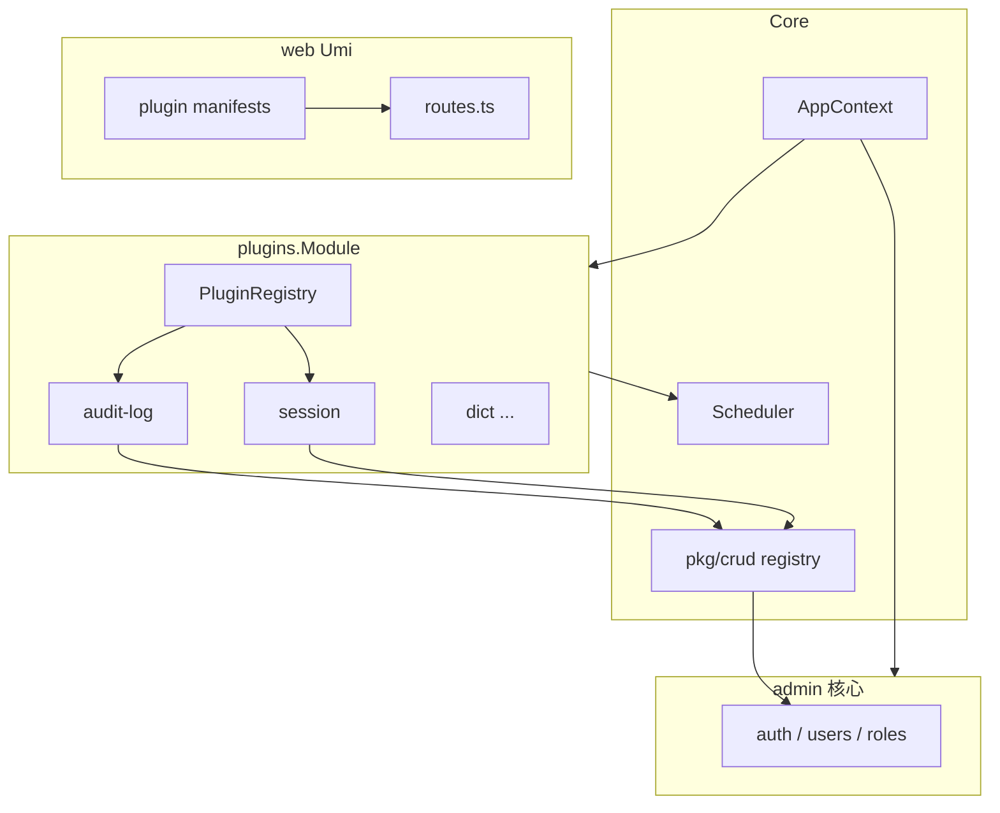

# Bico Admin 插件系统设计

> **状态**：设计稿（待评审）  
> **版本**：v0.1  
> **关联文档**：[项目结构](./structure.md) · [CRUD 包](./crud-pkg.md) · [AI Agent 说明](./AGENTS.md)

本文描述 Bico Admin 的**可选能力插件化**方案：审计日志、登录会话、系统配置 UI、任务管理 UI、CRUD 代码生成、数据字典等以插件交付，核心仓库保持精简。第一期采用**编译期内置插件**（Go module 同仓或子目录），不实现 `.so` 动态加载。

---

## 1. 目标与非目标

### 1.1 目标

| 目标 | 说明 |
|------|------|
| **可选功能解耦** | 非所有部署都需要的能力（如审计日志）不挤在 `internal/admin/handler` 根目录 |
| **统一契约** | 后端：路由、权限、迁移、定时任务、菜单元数据；前端：路由、菜单、`access` 与后端 permission key 对齐 |
| **复用现有栈** | 继续用 `crud.Module`、`AppContext` DI、`/admin-api` 分组与 JWT/权限中间件链 |
| **可开关** | 通过 `config.yaml`（及后续 DB）启用/禁用插件，禁用时无路由、无迁移表、无任务 |
| **可演进** | 契约预留扩展点，第三期可接动态加载而不推翻第一期 API |

### 1.2 非目标（第一期）

- Go `plugin` 包或任意 **运行时加载 `.so`**
- 插件市场、独立版本号、跨主版本 ABI 兼容
- 插件沙箱（进程隔离）；第一期与主程序**同进程、同 DB**
- 替换核心：`admin` 用户/角色/认证、Dashboard、`api` 模块**不**改为插件
- 前端微前端（qiankun 等）；第一期仍为 Umi 单仓构建，仅路由/菜单聚合

---

## 2. 为何需要插件，而不是继续扩展 `crud.Module`

当前扩展路径（见 [crud-pkg.md](./crud-pkg.md)）已很高效：在 `internal/admin/module.go` 的 `NewCRUDModules` 增加一个实现 `crud.Module` 的 Handler 即可。该方式适合**核心、人人需要**的功能。

插件化解决的是另一类问题：

| 维度 | 仅扩展 `crud.Module` | 插件 |
|------|----------------------|------|
| **归属** | 代码落在 `internal/admin`，与核心混排 | `internal/plugins/<id>/` 边界清晰 |
| **交付** | 改主仓、全量发版 | 可独立目录/未来独立仓库，主仓只保留 registry |
| **启用** | 编译即存在 | `plugins.enabled` 关闭后零路由、零表 |
| **横切能力** | 审计、会话等多处 hook，难用单 Handler 表达 | 插件可暴露 `Hooks` + 独立 CRUD UI |
| **前端** | 手改 `web/config/routes.ts` | 插件自带 `manifest` 与页面 chunk |
| **权限树** | 仍走 `crud.AddPermissions` | 相同机制，由插件注册器统一收集 |

**结论**：`crud.Module` 仍是插件内实现 Admin API 的**首选方式**；插件是在其之上的**打包、发现、迁移、任务、前端聚合**层，而不是替代 CRUD 框架。

---

## 3. 架构总览

### 3.1 与现有启动链的关系

今日启动顺序（见 [structure.md](./structure.md) 与 `cmd/main.go`）：

```
BuildContext → (可选) AutoMigrate → RegisterCoreRoutes → RegisterModules(admin, api, job) → Run
```

引入插件后：

```
BuildContext
  → 读取 plugins 配置，构建 PluginRegistry（仅 enabled）
  → Migrate：core migrate + 各 enabled 插件 Models
  → RegisterCoreRoutes
  → RegisterModules(
        admin,   // 核心：auth、用户、角色、dashboard…
        api,
        plugins.NewModule(registry),  // 聚合所有 enabled 插件
        job,     // 核心任务；插件任务在 plugins.Module 内注册到同一 Scheduler
    )
  → Run（OnStart） / 关闭（OnStop）
```

`app.Module` 接口不变（`Name()` + `Register(*AppContext)`），见 `internal/core/app/context.go`。

### 3.2 逻辑分层



### 3.3 API 与前端边界

- 所有后台插件 HTTP 能力默认挂在 **`/admin-api`** 下，与 `internal/admin/router.go` 一致。
- 插件复用 admin 已创建的 **JWT → 用户状态 → RequirePermission** 中间件（通过 `PluginAdminDeps` 注入，避免重复装配）。
- 前端路由 `access` 字段必须与后端 permission key **字符串完全一致**（见 [AGENTS.md](./AGENTS.md) 权限一节）。

---

## 4. 插件生命周期

| 阶段 | 时机 | 行为 |
|------|------|------|
| **Discover** | 编译期 | 插件在 `internal/plugins/registry.go`（或 `plugins/all` 包）显式注册；第一期不做目录扫描 |
| **Configure** | `BuildContext` 之后 | 根据 `config.plugins` 过滤 enabled；未知 id 打 warn 并跳过 |
| **Migrate** | `migrate` 命令 / `database.auto_migrate` 启动迁移 | 仅 enabled 插件的 `Models()` 并入 `AutoMigrate`；顺序：core → 插件按 `Meta().Order` |
| **Register** | `plugins.Module.Register` | 向 `crud` 注册权限树；向 admin 路由组挂载 CRUD/自定义路由；向 `Scheduler` 注册任务 |
| **Start** | `app.Run` 成功后 | 可选 `OnStart`（预热缓存、订阅事件等） |
| **Stop** | 优雅关闭 | 可选 `OnStop`（刷写缓冲、取消订阅） |

禁用插件时：**不**调用 `Register` / `Migrate` / `OnStart`，权限树中也不出现该插件节点。

---

## 5. 后端插件契约（Plugin Interface）

建议新建包：`internal/pkg/plugin`（契约）+ `internal/plugins/*`（实现）。

### 5.1 元数据 `Meta`

```go
type Meta struct {
    ID          string // 稳定标识，如 "audit-log"，用于配置与前端 manifest
    Name        string // 展示名
    Version     string // 语义化版本，第一期仅文档用途
    Description string
    Order       int    // 迁移与权限树相对顺序
    Dependencies []string // 其他插件 ID，第一期可只校验存在性
}
```

### 5.2 核心接口 `Plugin`

```go
type Plugin interface {
    Meta() Meta

    // 返回 GORM 模型指针切片，供 migrate 使用
    Models() []interface{}

    // 声明式 Admin API（推荐）
    AdminCRUDModules(deps *AdminDeps) []crud.Module

    // 非 CRUD 路由：在 /admin-api 下、已带认证中间件的分组内注册
    RegisterAdminRoutes(deps *AdminDeps, rg *gin.RouterGroup) error

    // 定时任务
    RegisterJobs(deps *Deps, s *scheduler.Scheduler) error

    // 菜单元数据（供角色权限 UI / 未来动态菜单；第一期可与前端 manifest 重复一份）
    MenuPermissions() []crud.Permission

    // 配置片段：映射到 config 中 plugins.<id> 或独立 yaml key
    BindConfig(cfg *config.Config) error

    OnStart(deps *Deps) error
    OnStop(deps *Deps) error
}
```

`AdminDeps` / `Deps` 建议字段（对齐 `AppContext`）：

| 字段 | 来源 | 用途 |
|------|------|------|
| `DB` | `ctx.DB` | 持久化 |
| `Cache` | `ctx.Cache` | 会话、限流、插件缓存 |
| `Logger` | `ctx.Logger` | 结构化日志 |
| `JWT` | `ctx.JWT` | 少见；多数用中间件 |
| `Cfg` / `ConfigManager` | 配置与热更新 |
| `JWTAuth`, `PermMiddleware`, `UserStatus` | 与 `admin.Module` 同源实例 |
| `Uploader` | 上传类插件 |

**原则**：插件**不得**自行 `New` 一套 JWT/权限中间件，必须使用注入的 `AdminDeps`，保证与 [AGENTS.md](./AGENTS.md) 中间件链一致。

### 5.3 与 `crud.Module` 的衔接

- 插件内 Handler 继续实现 `crud.Module` + `ModuleConfig()`，规范见 [crud-pkg.md](./crud-pkg.md)。
- `ParentPermission` 建议使用插件顶级权限，例如 `plugin:audit_log:manage`，避免与 `system:*` 混淆。
- 注册流程（在 `plugins.Module` 内）：

  1. `crud.AddPermissions(parentKey, plugin.MenuPermissions())`
  2. `crud.NewModuleRouter(deps.JWTAuth, deps.PermMiddleware, deps.UserStatus).RegisterModule(adminGroup, module)`

与 `internal/admin/router.go` 对 `NewCRUDModules` 的做法保持一致。

### 5.4 迁移

- 第一期不引入独立 migration 文件引擎；继续使用 **GORM `AutoMigrate`**，与 `internal/migrate/migrate.go` 一致。
- `migrate.AutoMigrate` 调整为：core 模型 + `registry.EnabledModels()`。
- 插件表名建议带前缀或插件专属 schema 命名，如 `plugin_audit_logs`，降低冲突。

### 5.5 定时任务

- 通过 `ctx.Scheduler` 注册，表达式格式与 [job.md](./job.md) 相同（6 位 cron）。
- 任务名建议 `plugin:<id>:<task>`，便于日志过滤。
- 禁用插件时不注册任务。

### 5.6 配置 Hook

```yaml
plugins:
  enabled:
    - audit-log
  audit-log:
    retention_days: 90
    capture_request_body: false
```

- `BindConfig` 将 `cfg.Plugins.AuditLog` 解析到插件私有 struct。
- 与 `ConfigManager` 热更新联动为第二期可选（见开放问题）。

### 5.7 事件 / 横切 Hook（审计类插件）

审计日志需要记录「谁在何时调用了什么」，建议在 `internal/pkg/plugin` 增加可选接口：

```go
type HTTPAuditContributor interface {
    Plugin() Plugin
    // 返回 Gin 中间件，在业务 Handler 之前/之后写审计记录
    AuditMiddleware() gin.HandlerFunc
}
```

第一期样本插件可仅在自有路由上使用；第二期在 `admin` 授权分组上统一挂载「审计中间件」并由 `audit-log` 插件提供实现。

---

## 6. 前端插件契约

### 6.1 Manifest

每个插件目录提供 `manifest.ts`：

```ts
// web/src/plugins/audit-log/manifest.ts
import type { PluginManifest } from '../types';

export const manifest: PluginManifest = {
  id: 'audit-log',
  routes: [
    {
      path: '/plugins/audit-logs',
      name: 'audit-logs',
      icon: 'fileSearch',
      component: './plugins/audit-log/pages/list',
      access: 'plugin:audit_log:menu',
    },
  ],
  localeNS: 'plugin.audit-log', // 对应 locales 文件
};
```

```ts
// web/src/plugins/types.ts
export interface PluginManifest {
  id: string;
  routes: Array<Record<string, unknown>>; // Umi route 子集
  localeNS?: string;
}
```

### 6.2 聚合

- `web/src/plugins/registry.ts`：根据构建时常量或 `config/config` 中的 `PLUGIN_IDS` 合并 `routes`。
- `web/config/routes.ts` 末尾：

  ```ts
  import { pluginRoutes } from '../src/plugins/registry';
  export default [ /* 核心路由 */, ...pluginRoutes ];
  ```

- 页面路径：`web/src/plugins/<id>/pages/**`，与核心 `src/pages/system/**` 分离。
- API：`web/src/plugins/<id>/services/*.ts`，遵循 [frontend-services.md](./frontend-services.md)。

### 6.3 懒加载

- Umi `component: './plugins/audit-log/pages/list'` 天然 code-split。
- 禁用插件时：构建期不 import 该 manifest（tree-shaking），或 runtime 空数组。

### 6.4 权限对齐

| 后端 | 前端 |
|------|------|
| `plugin:audit_log:menu` | `routes[].access` |
| `plugin:audit_log:list` | `useAccess()` 按钮显隐 |

角色权限树通过 `GET /admin-api/admin-roles/permissions` 返回的 `crud.GetAllPermissions()` 自动包含插件注册的节点（与现网行为一致）。

---

## 7. 插件与核心的交互

### 7.1 依赖方向

```
core (AppContext)
  ↑
admin（认证、用户、角色、权限中间件）
  ↑
plugins（可选业务能力）
  ↓ 仅通过公开接口
crud / response / pagination
```

- 插件**可以**依赖 `internal/pkg/*`、`internal/core/cache` 等稳定包。
- 插件**不应** import `internal/admin/handler` 私有实现；若需用户信息，通过 `AuthService` 接口或 Gin context `user_id`。
- 核心**不应** import 具体插件包，只 import `internal/plugins/registry`。

### 7.2 数据库

- 默认共享 `ctx.DB`；多租户/分库不在第一期范围。

### 7.3 缓存

- Key 建议 `plugin:<id>:...`，避免与 `auth:user:*` 冲突（见 `auth_service.go` 缓存键）。

### 7.4 与 `job` 模块

- 核心保留通用任务（如 `CleanTask`）。
- 插件任务在 `plugins.Module.Register` 中注册；避免与 `internal/job/register.go` 重复注册同名任务。

---

## 8. 目录结构建议

```
internal/
├── pkg/
│   └── plugin/           # 契约：Plugin、Meta、Registry、AdminDeps
├── plugins/
│   ├── registry.go       # 所有插件构造器列表 + Enabled(registry, cfg)
│   └── auditlog/         # 样本插件
│       ├── plugin.go
│       ├── model/
│       ├── handler/
│       └── middleware/   # 可选审计中间件
├── admin/                # 不变：核心后台
├── migrate/
│   └── migrate.go        # 调用 registry 收集模型
└── ...

web/src/
├── plugins/
│   ├── types.ts
│   ├── registry.ts
│   └── audit-log/
│       ├── manifest.ts
│       ├── pages/
│       ├── services/
│       └── locales/
└── pages/                # 核心页面
```

`cmd/main.go` 注册顺序建议：`admin` → `api` → `plugins` → `job`（若 job 依赖插件表，则 `plugins` 在 `job` 之前）。

---

## 9. 启用 / 禁用配置

### 9.1 config.yaml（第一期）

```yaml
plugins:
  enabled: []          # 空 = 不加载任何插件
  # enabled: ["audit-log"]
  audit-log:
    retention_days: 90
```

- 配置结构体挂在 `internal/core/config`，与 [config.md](./config.md) 风格一致。
- **编译仍包含**插件代码；仅运行时跳过注册。若需「裁剪二进制」，用 build tag（第二期）。

### 9.2 数据库开关（可选，第二期）

- 表 `plugin_settings (id, enabled, config_json)` + 超管 UI。
- 启动时 DB 覆盖 yaml 的 enabled 列表；需处理「关闭插件后表已存在」的运维策略。

---

## 10. 安全与权限模型

1. **默认拒绝**：所有 Admin 插件路由走 JWT + 权限中间件，无 `Public: true` 除非明确需求。
2. **权限命名**：建议 `plugin:<resource>:<action>`，与核心 `system:*`、`dashboard:*` 区分。
3. **超级管理员**：继续通过 `SuperAdminRoleCode` 拥有全部 permission keys（`GetAllPermissionKeys` 含插件键）。
4. **输入校验**：插件 Handler 复用 `crud.BaseHandler` 绑定与校验；禁止在审计日志中记录密码、token 明文。
5. **依赖安全**：第一期无第三方插件加载；未来动态加载需签名与 allowlist。
6. **CSRF / CORS**：沿用 core 中间件，插件不单独放宽。

---

## 11. 示例：`audit-log` 第一期样本

### 11.1 能力范围

- 记录：用户 ID、方法、路径、状态码、耗时、IP、User-Agent；可选请求体（脱敏）。
- Admin UI：分页查询、详情、按时间/用户筛选。
- 定时任务：按 `retention_days` 清理历史。

### 11.2 后端要点

| 项 | 内容 |
|----|------|
| ID | `audit-log` |
| 模型 | `AuditLog` → 表 `plugin_audit_logs` |
| CRUD | `AuditLogHandler` 实现 `crud.Module`，仅 `List`/`Get`（无 Create/Update 对外） |
| 权限 | `plugin:audit_log:manage` 父节点 + `menu` / `list` / `export` |
| 路由组 | `/admin-api/audit-logs` |
| 写入 | 第二期全局中间件；第一期可在文档中写「仅记录插件自有演示路由」或提供 `RegisterGlobalMiddleware` 钩子 |

### 11.3 前端要点

- `manifest.ts` 单菜单「审计日志」。
- ProTable 列表 + 详情抽屉，调用 `services/audit-log.ts`。

### 11.4 验收标准（实现阶段）

- `plugins.enabled` 含 `audit-log` 时：迁移建表、菜单可见、有权限可列表。
- 关闭后：无菜单、无 API、迁移命令不建插件表（或跳过插件模型）。

---

## 12. 从现有模块的迁移路径

| 现状 | 迁移策略 |
|------|----------|
| `internal/admin/handler/*` 核心 CRUD | **保留**，不搬插件 |
| 未来「字典」「系统配置 UI」 | 新建 `internal/plugins/dict` 等，从 admin 抽离 |
| `internal/job/task/*` 中与某插件强绑定任务 | 随插件迁至 `plugins/<id>/job.go` |
| `migrate.go` 中模型 | 核心留 `admin`；插件模型迁到 `Plugin.Models()` |
| `web/config/routes.ts` | 核心路由保留；插件路由迁到 manifest 聚合 |
| Swagger | 继续用 `crud.ModuleConfig` + 现有 enhance 流程（`admin.NewCRUDModules` 模式可复制到插件注册器） |

**渐进原则**：先新增 registry + audit-log 样本，**不**一次性搬迁所有可选功能。

---

## 13. 分阶段路线图

### Phase 1 — 契约 + 样本（本设计评审目标）

- [ ] `internal/pkg/plugin` 接口与 `PluginRegistry`
- [ ] `plugins.Module` 接入 `cmd/main.go`
- [ ] `migrate` 支持插件模型
- [ ] `config.plugins.enabled`
- [ ] 前端 `plugins/registry` + types
- [ ] 样本 `audit-log` 端到端

### Phase 2 — 可选功能插件化

- 登录会话、系统配置 UI、任务管理 UI、字典、CRUD codegen 等按优先级拆插件
- 审计全局中间件与核心路由挂钩
- 可选 DB 级启用开关
- build tag 裁剪未使用插件

### Phase 3 — 动态加载（调研）

- Go plugin / 独立进程 sidecar / WASM 等方案对比
- 版本兼容、签名分发、热加载风险说明
- **不承诺** Phase 3 时间表

---

## 14. 开放问题（请维护者确认）

1. **插件 ID 命名**：kebab-case（`audit-log`）与 permission 中 snake（`audit_log`）是否接受本文约定？
2. **路由前缀**：统一 `/admin-api/...`  vs  插件专属 `/admin-api/plugins/<id>/...`？
3. **前端菜单挂载点**：顶级「扩展」分组 vs 挂在「系统管理」下？
4. **禁用插件后数据**：保留表仅隐藏 UI，还是提供 uninstall 迁移？
5. **独立仓库**：插件是否计划拆到 `bico-admin-plugins` 同组织多 module，第一期仍 vendor 进主仓？
6. **审计范围**：全量 `/admin-api` 还是可配置 path 前缀？请求体是否默认关闭？
7. **与 `job` 模块合并**：是否长期保留 `internal/job` 仅放核心任务，插件任务全部进插件？
8. **Config 热更新**：插件配置变更是否需要监听 `ConfigManager` 并重载任务 cron？
9. **国际化**：插件 locale 是否必须同时提供 `zh-CN` / `en-US`？
10. **Codegen 插件**：生成代码写回主仓还是生成到 `plugins/<id>/` 临时目录？

---

## 附录 A：与现有文档的对照

| 现有机制 | 插件中的用法 |
|----------|----------------|
| [structure.md](./structure.md) `app.Module` | 增加 `plugins.Module` 一个入口 |
| [crud-pkg.md](./crud-pkg.md) `crud.Module` | 插件 `AdminCRUDModules` 返回值 |
| [crud-pkg.md](./crud-pkg.md) `AddPermissions` | 插件 `MenuPermissions` + 注册器调用 |
| [AGENTS.md](./AGENTS.md) 权限前后端对齐 | manifest `access` = 后端 permission key |
| [job.md](./job.md) Scheduler | `RegisterJobs` |
| `internal/migrate/migrate.go` | 合并 `Plugin.Models()` |

---

## 附录 B：`registry` 伪代码（实现参考）

```go
// internal/plugins/registry.go
func All() []plugin.Plugin {
    return []plugin.Plugin{
        auditlog.New(),
        // session.New(),
    }
}

func Enabled(cfg *config.Config) []plugin.Plugin {
    var out []plugin.Plugin
    for _, p := range All() {
        if cfg.Plugins.IsEnabled(p.Meta().ID) {
            out = append(out, p)
        }
    }
    return out
}
```

```go
// internal/plugins/module.go — 实现 app.Module
func (m *Module) Register(ctx *app.AppContext) error {
    deps := buildAdminDeps(ctx) // 与 admin 共享中间件实例的方案见开放问题
    group := ctx.Engine.Group("/admin-api", deps.JWTAuth, deps.UserStatus.Check())
    for _, p := range m.registry.Enabled() {
        crud.AddPermissions(p.Meta().ParentPermKey(), p.MenuPermissions())
        router := crud.NewModuleRouter(deps.JWTAuth, deps.PermMiddleware, deps.UserStatus)
        for _, mod := range p.AdminCRUDModules(deps) {
            router.RegisterModule(group, mod)
        }
        if err := p.RegisterAdminRoutes(deps, group); err != nil {
            return err
        }
        if err := p.RegisterJobs(deps.ToDeps(), ctx.Scheduler); err != nil {
            return err
        }
    }
    return nil
}
```

（`buildAdminDeps` 需避免与 `admin.Module` 重复创建不兼容的 `AuthService` 实例——实现阶段建议抽取 `internal/admin/wire` 或导出 factory。）

---

**评审通过后**，按 Phase 1 任务列表开实现 PR，并更新 [structure.md](./structure.md) 目录树与 README 链接。
